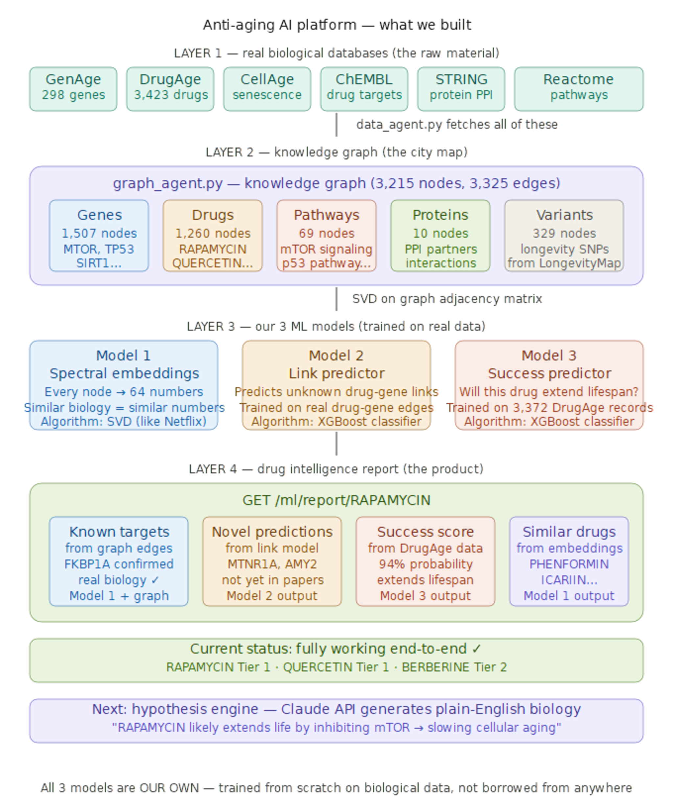

# Anti-Aging AI Platform  v1.0

A multi-agent drug discovery platform that combines biological knowledge graphs with machine learning to identify and rank longevity drug candidates.

---

## What it does

Given any drug name (RAPAMYCIN, QUERCETIN, METFORMIN etc.) it returns:

- **Known gene targets** — pulled from ChEMBL and linked to aging databases
- **Novel target predictions** — genes the drug likely targets but nobody has tested yet
- **Success probability** — likelihood the drug extends lifespan (trained on 3,423 DrugAge records)
- **Similar compounds** — drugs with similar biological profiles
- **Overall tier** — Tier 1 / 2 / 3 candidate classification

---
## System Architecture



---

## Tech stack

| Layer | Technology |
|---|---|
| API server | FastAPI + Uvicorn |
| Knowledge graph | NetworkX (3,200+ nodes, 3,300+ edges) |
| ML embeddings | Scipy SVD (spectral graph embeddings) |
| ML prediction | XGBoost (link predictor + success predictor) |
| Data sources | HAGR, ChEMBL, STRING, Reactome, ClinicalTrials.gov |

---

## Project structure

```
antiaging_ai_platform/
├── api/
│   ├── main.py                 ← FastAPI server (all endpoints)
│   └── agents/
│       ├── data_agent.py       ← fetches from 6 biological databases
│       ├── graph_agent.py      ← builds and scores knowledge graph
│       └── ml_agent.py         ← 3 ML models (embeddings, link, success)
├── populate_graph.py           ← seeds the knowledge graph (run once)
├── visualize_graph.py          ← graph visualisation utility
├── requirements.txt            ← all Python dependencies
├── graph_storage/              ← auto-created: stores graph.pkl
├── data_cache/                 ← auto-created: stores API response cache
└── ml_models/                  ← auto-created: stores trained model files
```

---

## Setup — step by step

### 1. Prerequisites

- Python 3.10 or higher
- Git
- Internet connection (the platform fetches live data from biological APIs)

### 2. Clone the repository

```bash
git clone https://github.com/YOUR_USERNAME/antiaging_ai_platform.git
cd antiaging_ai_platform
```

### 3. Create virtual environment

**Windows:**
```powershell
python -m venv venv
.\venv\Scripts\Activate.ps1
```

**Mac / Linux:**
```bash
python3 -m venv venv
source venv/bin/activate
```

### 4. Install dependencies

```bash
pip install -r requirements.txt
```

> **Windows long-path issue?** If you get an OSError about file paths, install packages one by one:
> ```powershell
> pip install fastapi uvicorn requests pandas numpy scipy networkx
> pip install xgboost
> pip install scikit-learn --no-deps
> pip install threadpoolctl joblib matplotlib pydantic
> ```

### 5. Start the API server

```bash
uvicorn api.main:app --reload
```

Server starts at `http://127.0.0.1:8000`
Swagger docs at `http://127.0.0.1:8000/docs`

### 6. Populate the knowledge graph (first time only)

Open a **second terminal**, activate venv, then run:

```bash
python populate_graph.py
```

This takes 10-20 minutes. It downloads data from 6 biological databases and builds the knowledge graph. You will see node counts growing in the terminal.

**Expected output:**
```
Graph: 3,200+ nodes  3,300+ edges
  gene      1,507
  drug      1,260
  pathway      69
  variant     329
  protein      10
```

### 7. Train the ML models

```bash
python agents/ml_agent.py
```

Takes 2-5 minutes. Trains 3 models and saves them to `ml_models/`.

**Expected output:**
```
[Phase 1] Spectral embeddings...   3215 nodes embedded
[Phase 2] Link predictor...        accuracy=0.85  AUC=0.82
[Phase 3] Success predictor...     accuracy=0.70  AUC=0.65
ALL MODELS SAVED TO ml_models/
```

### 8. Restart the server

```bash
uvicorn api.main:app --reload
```

The ML models are now loaded. Open `http://127.0.0.1:8000/docs` — you will see the **ML Agent** section.

---

## Key endpoints

### Drug intelligence report
```
GET /ml/report/{drug}
```
Example: `GET /ml/report/RAPAMYCIN`

Returns the complete drug intelligence report including tier, known targets, novel predictions, and success probability.

### Gene scores
```
GET /graph/scores/genes
```
Returns top aging genes ranked by biological relevance score (centrality, druggability, evidence tier, pathway coverage).

### Drug repurposing scores
```
GET /graph/scores/drugs
```
Returns drug candidates ranked by multi-target longevity score.

### Similar compounds
```
GET /ml/similar/{node}
```
Example: `GET /ml/similar/MTOR` — returns genes/drugs closest to MTOR in embedding space.

### Novel target predictions
```
GET /ml/predict/targets/{drug}?threshold=0.60
```
Predicts gene targets for a drug that are NOT currently in the graph.

### Knowledge graph node inspector
```
GET /graph/node/{node}
```
Example: `GET /graph/node/RAPAMYCIN` — shows all neighbors and attributes.

---

## All API sections

| Section | Description |
|---|---|
| Health | `/` and `/health` |
| Q&A | `/ask?question=...` — natural language routing |
| HAGR | `/hagr/aging-genes`, `/hagr/drugage`, `/hagr/cellage`, `/hagr/longevitymap`, `/hagr/anage`, `/hagr/gendr` |
| External Bio APIs | `/bio/ppi/{gene}`, `/bio/pathways/{gene}`, `/bio/drug-targets/{gene}`, `/bio/compound-targets/{compound}` |
| Knowledge Graph | `/graph/stats`, `/graph/scores/genes`, `/graph/scores/drugs`, `/graph/visualize` |
| Graph Debug | `/graph/node/{node}`, `/graph/subgraph/{node}`, `/graph/degree-distribution` |
| ML Agent | `/ml/status`, `/ml/train/*`, `/ml/similar/{node}`, `/ml/predict/targets/{drug}`, `/ml/predict/success/{drug}`, `/ml/report/{drug}` |

---

## Data sources

| Database | URL | What it provides |
|---|---|---|
| GenAge Human | genomics.senescence.info | 298 curated human aging genes |
| DrugAge | genomics.senescence.info | 3,423 longevity drug records with lifespan data |
| CellAge | genomics.senescence.info | 280 cellular senescence genes |
| LongevityMap | genomics.senescence.info | 2,000+ longevity-associated SNPs |
| AnAge | genomics.senescence.info | 4,000+ species comparative aging data |
| GenDR | genomics.senescence.info | Dietary restriction genes |
| ChEMBL | ebi.ac.uk/chembl | Drug-target activity data |
| STRING | string-db.org | Protein-protein interactions |
| Reactome | reactome.org | Biological pathways |
| ClinicalTrials | clinicaltrials.gov | Active aging trials |

---

## Sample output — RAPAMYCIN report

```json
{
  "drug": "RAPAMYCIN",
  "overall_tier": "Tier 1 — Strong candidate",
  "success_probability": 0.9407,
  "known_targets": ["FKBP1A"],
  "n_known_targets": 1,
  "novel_target_predictions": [
    { "predicted_gene": "MTNR1A", "confidence": 0.9639 },
    { "predicted_gene": "AMY2",   "confidence": 0.9288 }
  ],
  "similar_compounds": [
    { "node": "PHENFORMIN", "similarity": 0.9988 },
    { "node": "ICARIIN",    "similarity": 0.9988 }
  ]
}
```

---

## Notes for first-time setup

- `graph_storage/`, `data_cache/`, and `ml_models/` are excluded from git (see `.gitignore`). They are created automatically when you run `populate_graph.py` and `ml_agent.py`.
- Population script takes 10-20 min depending on internet speed — the biological APIs (ChEMBL, STRING) are external and can be slow.
- If any endpoint times out during `populate_graph.py`, the script skips it and continues. Run the script again — it merges cleanly with existing data.
- The server must be running (`uvicorn`) when you run `populate_graph.py`.

---

## Version

v1.0 — March 2026

Built with FastAPI, NetworkX, XGBoost, and data from HAGR (Human Ageing Genomic Resources).
